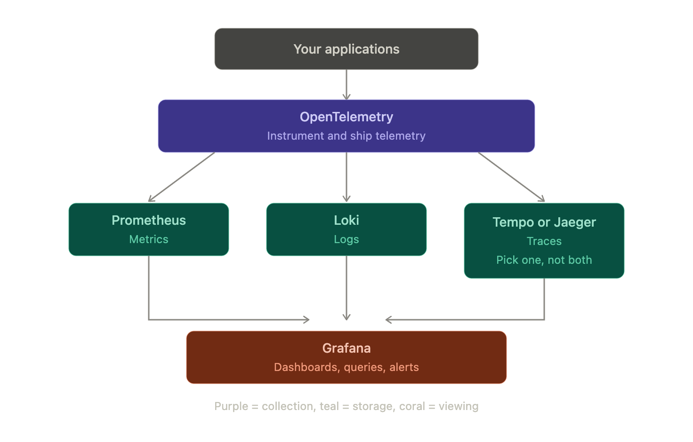

# Observability Instructions

How to add tracing, metrics, and logging to the order and payment services
running in the `ecommerce` kind cluster.

> **Note on sources.** These instructions are adapted from a book chapter written
> around 2022. Two of its central APIs no longer exist. See
> [What changed since the book](#what-changed-since-the-book) before copying any
> code from it — the book's snippets will not compile today.

---

## Part 1 — Theory

### The problem

Locally, one request = one process. When something breaks you read one log file
and you're done.

In Kubernetes you have 3 order pods and 3 payment pods. A single "create order"
call touches an order pod, then a payment pod, then Postgres. When it's slow, the
question "which of those was slow?" has no answer from logs alone, because each
pod writes its own logs and nothing connects them.

Observability is about connecting them.

### The three pillars

| Pillar      | Answers                                      | Tool here              |
| ----------- | -------------------------------------------- | ---------------------- |
| **Traces**  | Where did the time go? Which service failed? | Jaeger                 |
| **Metrics** | How many requests/sec? What's p95 latency?   | Prometheus             |
| **Logs**    | What exactly happened in this one request?   | Elasticsearch + Kibana |

### Traces and spans

Two concepts do most of the work:

- A **span** is one unit of work — "the payment service handled Create", or "this
  SQL query ran". It has a name, a start time, a duration, and key/value
  attributes.
- A **trace** is all the spans for one request, linked into a tree.

For your create-order flow, a trace looks like:

```
Trace (id: 4a55375c...)  total 4.2ms
└─ order/Create                    4.2ms   ← span, in the order pod
   └─ payment/Create               3.36ms  ← span, in the payment pod
      └─ INSERT INTO payments      2.88ms  ← span, from GORM
```

You can immediately see payment is 80% of the time, and the DB write is most of
payment. That's the entire value proposition.

### Context propagation — the key mechanism

How does the payment pod know it belongs to the same trace as the order pod?

The order service puts the trace ID into the gRPC request **metadata** (headers).
The payment service reads it back out and makes its spans children of the one it
received. This passing-along is called **propagation**, and the thing that does it
is a **propagator**.

This is why `context.Context` matters so much in Go tracing. The span lives in
the context. If you drop the context — start a fresh `context.Background()`
halfway through — the trace breaks into two disconnected pieces.

> **This affects your code.** `order/internal/adapters/payment/payment.go` calls
> `a.payment.Create(context.Background(), ...)`. That discards the incoming
> context and will sever the trace. Part 3 fixes this.

### Where the data goes

```
order pod   ──┐
payment pod ──┤ OTLP ──► Jaeger  ──► traces UI (port 16686)
              │
              └─ stdout logs ──► Fluent Bit ──► Elasticsearch ──► Kibana
```

**OTLP** (OpenTelemetry Line Protocol) is the wire format. Your app doesn't need
to know anything about Jaeger specifically — it speaks OTLP, and any OTLP-capable
backend can receive it. That's the whole point of OpenTelemetry: instrument once,
swap backends freely.

Two pieces of vocabulary you'll see in the code:

- **Exporter** — the thing that ships spans out over the network.
- **TracerProvider** — global config: which exporter, which service name, which
  attributes. Set once at startup in `main.go`.

Spans are **batched**, not sent one-by-one — the exporter buffers them and flushes
periodically. Consequence: if your process exits immediately, buffered spans are
lost. You must call `tp.Shutdown()` on exit to flush.

---

## What changed since the book

Verified against the module proxy on 2026-09-17:

| Book says                                   | Status                                                                                                | Use instead                                        |
| ------------------------------------------- | ----------------------------------------------------------------------------------------------------- | -------------------------------------------------- |
| `go.opentelemetry.io/otel/exporters/jaeger` | **Abandoned.** Last version v1.17.0, while the rest of otel is at v1.46.0                             | `otlptracehttp` — Jaeger accepts OTLP natively now |
| `otelgrpc.UnaryServerInterceptor()`         | **Removed.** Does not exist in otelgrpc v0.71.0 — only `NewServerHandler` / `NewClientHandler` remain | `grpc.StatsHandler(otelgrpc.NewServerHandler())`   |
| `semconv/v1.10.0`                           | Very old                                                                                              | `semconv/v1.26.0` or later                         |

The `StatsHandler` change is not cosmetic. The old interceptor only saw unary
calls; a stats handler sees the full connection lifecycle, which is why it
replaced the interceptor approach.

---

## Part 2 — Install Jaeger

### Add the Helm repo

```sh
brew install helm
helm repo add jaegertracing https://jaegertracing.github.io/helm-charts
helm repo update
```

> The book uses a personal chart (`huseyinbabal/jaeger`). Prefer the official one
> above — it's maintained, and modern Jaeger accepts OTLP directly, so the
> separate OpenTelemetry Collector the book needed is no longer required for a
> basic setup.

### Install all-in-one

```sh
helm install jaeger jaegertracing/jaeger \
  --namespace observability --create-namespace \
  --set provisionDataStore.cassandra=false \
  --set allInOne.enabled=true \
  --set storage.type=memory \
  --set agent.enabled=false \
  --set collector.enabled=false \
  --set query.enabled=false
```

`allInOne` runs collector, query, and UI in one pod with in-memory storage.
Perfect for local learning; loses all traces on restart.

### Find the service name and ports

Chart service names vary between versions, so **check rather than assume**:

```sh
kubectl get svc -n observability
```

Look for a service exposing these ports:

| Port  | Purpose                                          |
| ----- | ------------------------------------------------ |
| 4317  | OTLP over gRPC — where your services send traces |
| 4318  | OTLP over HTTP — same, HTTP flavour              |
| 16686 | Jaeger UI                                        |

Your OTLP endpoint will be the service name plus namespace:

```
jaeger-collector.observability.svc.cluster.local:4318
```

The `.svc.cluster.local` suffix is Kubernetes DNS — same mechanism as the
`payment:3001` your order service already uses, just fully qualified so it works
across namespaces.

### Open the UI

```sh
kubectl port-forward -n observability svc/jaeger 16686:16686
```

Then visit <http://localhost:16686>. It'll be empty until Part 3.

---

## Part 3 — Instrument the order service

### Install dependencies

```sh
cd order
go get go.opentelemetry.io/otel
go get go.opentelemetry.io/otel/sdk
go get go.opentelemetry.io/otel/exporters/otlp/otlptrace/otlptracehttp
go get go.opentelemetry.io/contrib/instrumentation/google.golang.org/grpc/otelgrpc
go mod tidy
```

### Add the config getter

Your `config/config.go` already fails fast on missing env vars. Stay consistent —
add to `order/config/config.go` and `payment/config/config.go`:

```go
func GetOtelEndpoint() string {
	return getEnvironmentValue("OTEL_EXPORTER_OTLP_ENDPOINT")
}
```

### Set up the tracer provider

In `order/cmd/main.go`:

```go
import (
	"context"
	"log"

	"go.opentelemetry.io/otel"
	"go.opentelemetry.io/otel/attribute"
	"go.opentelemetry.io/otel/exporters/otlp/otlptrace/otlptracehttp"
	"go.opentelemetry.io/otel/propagation"
	"go.opentelemetry.io/otel/sdk/resource"
	tracesdk "go.opentelemetry.io/otel/sdk/trace"
	semconv "go.opentelemetry.io/otel/semconv/v1.26.0"
)

func tracerProvider(ctx context.Context, endpoint, service string) (*tracesdk.TracerProvider, error) {
	// WithInsecure because there is no TLS inside the cluster.
	exp, err := otlptracehttp.New(ctx,
		otlptracehttp.WithEndpoint(endpoint),
		otlptracehttp.WithInsecure(),
	)
	if err != nil {
		return nil, err
	}

	tp := tracesdk.NewTracerProvider(
		// Buffers spans and flushes in batches rather than one call per span.
		tracesdk.WithBatcher(exp),
		// These attributes appear on every span, and are how you filter in the UI.
		tracesdk.WithResource(resource.NewWithAttributes(
			semconv.SchemaURL,
			semconv.ServiceName(service),
			attribute.String("environment", config.GetEnv()),
		)),
	)
	return tp, nil
}
```

Note `otlptracehttp.WithEndpoint` takes `host:port` **without** a scheme — passing
`http://...` is a common error that produces a confusing connection failure.

### Wire it into main

```go
func main() {
	ctx := context.Background()

	tp, err := tracerProvider(ctx, config.GetOtelEndpoint(), "order")
	if err != nil {
		log.Fatalf("Failed to create tracer provider. Error: %v", err)
	}
	// Flush buffered spans on exit, or the last traces are silently lost.
	defer func() {
		if err := tp.Shutdown(ctx); err != nil {
			log.Printf("tracer shutdown: %v", err)
		}
	}()

	otel.SetTracerProvider(tp)
	// Enables the trace ID to travel in gRPC metadata between services.
	otel.SetTextMapPropagator(propagation.NewCompositeTextMapPropagator(
		propagation.TraceContext{},
		propagation.Baggage{},
	))

	// ...rest of main unchanged
}
```

Both lines matter. `SetTracerProvider` makes spans get _recorded_;
`SetTextMapPropagator` makes them get _connected across services_. Omit the
second and you'll get two separate single-service traces instead of one.

### Add the server handler

In `order/internal/adapters/grpc/server.go`, change:

```go
grpcServer := grpc.NewServer()
```

to:

```go
grpcServer := grpc.NewServer(
	grpc.StatsHandler(otelgrpc.NewServerHandler()),
)
```

Do the same in `payment/internal/adapters/grpc/server.go`.

### Add the client handler — and fix the context

This is the step that makes traces span both services.

In `order/internal/adapters/payment/payment.go`, add the stats handler alongside
your existing circuit-breaker interceptor (they coexist fine):

```go
opts = append(opts, grpc.WithStatsHandler(otelgrpc.NewClientHandler()))
```

Then fix the dropped context. `Charge` currently does:

```go
func (a *Adapter) Charge(order *domain.Order) error {
	_, err := a.payment.Create(context.Background(), ...)
```

`context.Background()` has no span in it, so propagation has nothing to send.
Thread the real context through instead — change the signature to accept a
`ctx context.Context` as its first parameter and pass it down:

```go
func (a *Adapter) Charge(ctx context.Context, order *domain.Order) error {
	_, err := a.payment.Create(ctx, ...)
```

You'll need to update the `ports.PaymentPort` interface and the calling code in
`internal/application/core/api/api.go` to match, passing through the context the
gRPC handler already receives.

> Without this change everything still _runs_, and Jaeger still shows traces —
> but order and payment appear as two unrelated traces. That symptom is confusing
> enough that it's worth doing properly the first time.

### Update the Kubernetes deployments

Add to the `env:` block in both `k8s/deployment-order.yaml` and
`k8s/deployment-payment.yaml`:

```yaml
- name: OTEL_EXPORTER_OTLP_ENDPOINT
  value: 'jaeger-collector.observability.svc.cluster.local:4318'
```

Use whatever service name `kubectl get svc -n observability` actually showed.

Because `config.go` calls `log.Fatalf` on a missing variable, forgetting this
means an immediate `CrashLoopBackOff` with a clear message — by design.

### Rebuild and redeploy

```sh
docker build -t order:latest ./order
docker build -t payment:latest ./payment
kind load docker-image order:latest --name ecommerce
kind load docker-image payment:latest --name ecommerce
kubectl rollout restart deployment order payment
```

`kind load` replaces the image, but running pods keep the old one — the
`rollout restart` is what actually picks it up.

---

## Part 4 — Trace database calls

GORM has an official OpenTelemetry plugin, which produces those SQL-level spans.

```sh
go get gorm.io/plugin/opentelemetry/tracing
```

In `internal/adapters/db/db.go`, after opening the connection:

```go
if err := db.Use(tracing.NewPlugin()); err != nil {
	return nil, err
}
```

Now each query appears as a child span with the SQL statement attached — that's
how you spot a slow or unindexed query.

---

## Part 5 — Logs with trace IDs

### The idea

A log line saying `"payment failed"` is nearly useless across 6 pods. The same
line carrying `trace_id=4a55375c...` lets you pull up every log from every
service for that exact request, in order.

You get this by writing a **log formatter** that pulls the trace ID out of the
context and injects it into every line.

### Install logrus

```sh
go get github.com/sirupsen/logrus
```

### The formatter

```go
import (
	log "github.com/sirupsen/logrus"
	"go.opentelemetry.io/otel/trace"
)

type serviceLogger struct {
	formatter log.JSONFormatter
}

func (l serviceLogger) Format(entry *log.Entry) ([]byte, error) {
	span := trace.SpanFromContext(entry.Context)
	entry.Data["trace_id"] = span.SpanContext().TraceID().String()
	entry.Data["span_id"] = span.SpanContext().SpanID().String()
	return l.formatter.Format(entry)
}

func init() {
	log.SetFormatter(serviceLogger{
		formatter: log.JSONFormatter{FieldMap: log.FieldMap{"msg": "message"}},
	})
	log.SetOutput(os.Stdout)
	log.SetLevel(log.InfoLevel)
}
```

`init()` runs automatically at program start, before `main()`.

### Using it

The context is mandatory — this is the whole mechanism:

```go
log.WithContext(ctx).Info("Creating order...")   // ✅ has trace_id
log.Info("Creating order...")                    // ❌ trace_id is all zeros
```

An all-zeros trace ID (`00000000000000000000000000000000`) means the context had
no span — either you forgot `WithContext`, or the context was replaced upstream.

Output:

```json
{
	"level": "info",
	"message": "Creating order...",
	"span_id": "1ab65b1c982ee940",
	"time": "2026-09-17T06:37:25Z",
	"trace_id": "4a55375c835c1e0f78d5a0001b6f5f5d"
}
```

JSON looks noisy in a terminal but is the point: log backends map JSON fields to
searchable fields automatically. Plain text would need a custom parser.

---

## Part 6 — Log collection (optional, heavy)

This part is longer than the others because there are four separate pieces and
they only make sense together. Read the theory first — the commands are trivial
once the shape is clear.

### 6.1 Why bother? `kubectl logs` already works

It works until it doesn't. Concretely, with your 3 order and 3 payment pods:

- **You must know the pod name.** A request landed on one of 3 order pods. Which?
  You don't know, so you check all three by hand.
- **Logs die with the pod.** `kubectl logs` reads from the node's disk. Delete a
  pod — or let Kubernetes restart a crashed one — and those logs are gone. Your
  order pods already restarted twice waiting for Postgres; those logs are
  unrecoverable now.
- **No cross-service search.** You cannot ask "show me every line from every
  service for trace_id 4a55..." That question spans 6 pods and `kubectl logs`
  reads one at a time.
- **No history.** The kubelet rotates log files. Yesterday's logs are typically
  already deleted.

Log aggregation solves all four by **copying logs off the nodes into a database
built for searching**, before they disappear.

### 6.2 How container logs physically work

The thing that surprises most people: there is no logging _system_ in a container.

1. Your Go code calls `log.Info(...)`, which writes to **stdout**.
2. The container runtime captures that stream and appends it to a file on the
   **node's** filesystem, under `/var/log/pods/`, with symlinks in
   `/var/log/containers/` named
   `<pod>_<namespace>_<container>-<id>.log`.
3. `kubectl logs` just asks the kubelet to read that file back.

That's the whole mechanism. So collecting logs means nothing more clever than
**reading those files and shipping them somewhere**. The filename itself encodes
pod, namespace, and container — which is how the collector knows what it's
looking at without you configuring anything.

This is also why the rule "log to stdout, never to a file" exists in containers.
Write to a file inside the container and it's invisible to all of this, and it
dies with the pod.

### 6.3 Why a DaemonSet

The log files live on **each node**, so you need a reader on each node. Your
cluster has four (one control-plane, three workers).

A **DaemonSet** is the Kubernetes object meaning exactly "one pod per node." Not
a replica count — a rule. Add a node and it automatically gets one; drain a node
and it goes away. This is what Deployments can't express, and it's why every log
collector, metrics agent, and CNI plugin ships as a DaemonSet.

The collector pod mounts the node's `/var/log` directory read-only, so a process
inside a container can read files belonging to the host.

```
node: ecommerce-worker
├── /var/log/containers/order-xxx.log      ← written by the runtime
├── /var/log/containers/payment-yyy.log
└── fluent-bit pod  ── tails both, ships out ──► Elasticsearch
```

### 6.4 The four pieces

| Piece             | Role                                                     | Analogy       |
| ----------------- | -------------------------------------------------------- | ------------- |
| **Fluent Bit**    | Reads log files on each node, parses, enriches, forwards | The courier   |
| **Elasticsearch** | Stores logs, makes them searchable                       | The database  |
| **Kibana**        | Web UI for querying Elasticsearch                        | The dashboard |
| **ECK operator**  | Installs and manages the two above                       | The installer |

Fluent Bit is a C program using ~5 MB of RAM — deliberately tiny, because it runs
on every node. (Fluentd is its bigger Ruby sibling; Fluent Bit is the standard
choice now.)

### 6.5 How Fluent Bit thinks: tag, then match

Fluent Bit is a pipeline. Every record flows through four stages:

```
INPUT ──► PARSER ──► FILTER ──► OUTPUT
 tail      JSON     kubernetes      es
```

- **INPUT** (`tail`) — follows `/var/log/containers/*.log`, like `tail -f`.
- **PARSER** — turns the raw line into structured fields. Your logs are already
  JSON thanks to Part 5, so this step reads them into real fields rather than one
  opaque string. **This is the payoff of the JSON formatter.**
- **FILTER** (`kubernetes`) — enriches each record with pod name, namespace,
  container name, labels, by asking the Kubernetes API. This is how you get
  `kubernetes.labels.service = order` as a searchable field without configuring
  anything per-service.
- **OUTPUT** (`es`) — ships to Elasticsearch.

The glue between stages is the **tag**. Each input attaches a tag to its records;
the Kubernetes input tags everything `kube.<namespace>.<pod>.<container>`. Each
output declares a `Match` pattern against those tags.

So in the config below:

```
Match kube.*
```

means "everything tagged `kube.` anything" — i.e. all container logs. If you
wanted only order logs you'd narrow the pattern. That's the entire routing model:
tag on the way in, match on the way out.

### 6.6 How Elasticsearch stores things

Three terms, borrowed from databases:

| Elasticsearch                 | Rough SQL equivalent                      |
| ----------------------------- | ----------------------------------------- |
| **Document**                  | A row — here, one log line                |
| **Index**                     | A table — a named collection of documents |
| **Index pattern** / data view | A view spanning many indices by wildcard  |

The config line `Logstash_Format On` tells Fluent Bit to write into **one index
per day**, named `logstash-2026.09.17`. That's the standard convention, and the
reason is retention: deleting old logs becomes "drop yesterday's index," which is
instant, instead of a slow mass-delete of individual rows.

Because logs are spread over many daily indices, you search them through an
**index pattern** like `logstash-*`, which is the one piece of setup you do by
hand in Kibana.

### 6.7 What an operator is (and why the install looks odd)

The install has two unusual steps before anything runs:

```sh
kubectl create -f .../crds.yaml       # step 1
kubectl apply  -f .../operator.yaml   # step 2
```

**Step 1 — CRDs.** A _Custom Resource Definition_ teaches your cluster a new
object type. Kubernetes natively knows `Deployment` and `Service`; it has never
heard of `Elasticsearch`. The CRD registers `kind: Elasticsearch` as a real API
type, so that `kubectl apply` accepts it and `kubectl get elasticsearch` works.

**Step 2 — the operator.** A CRD only defines the _vocabulary_; nothing acts on
it. The operator is a pod that watches for those objects and does the real work —
creating StatefulSets, generating TLS certificates, managing passwords, handling
version upgrades.

So the pattern is: CRD teaches the noun, operator provides the verb. You then
write a short declarative spec and the operator expands it into dozens of
underlying objects. This is why the Elasticsearch spec below is only 12 lines for
something that would otherwise be a very large manifest.

### 6.8 Install Elasticsearch

> **Version note.** The book pins ECK 2.5.0 / Elasticsearch 8.5.2, from ~2022.
> The current ECK release is **v3.5.0**. The commands below use the book's
> versions because they're known to work together; if you'd rather run current
> versions, check the ECK compatibility matrix for the matching Elasticsearch
> version rather than mixing arbitrarily — I haven't verified which ES versions
> ECK 3.5.0 supports.

```sh
kubectl create -f https://download.elastic.co/downloads/eck/2.5.0/crds.yaml
kubectl apply -f https://download.elastic.co/downloads/eck/2.5.0/operator.yaml

# Watch the operator come up before continuing
kubectl -n elastic-system get pods -w
```

Now request a cluster. Note you're describing _what you want_, not how to build
it — the operator figures that out:

```sh
cat <<EOF | kubectl apply -f -
apiVersion: elasticsearch.k8s.elastic.co/v1
kind: Elasticsearch
metadata:
  name: quickstart
spec:
  version: 8.5.2
  nodeSets:
  - name: default
    count: 1
    config:
      # Elasticsearch normally memory-maps index files and wants a high
      # vm.max_map_count on the host. kind nodes don't have it, so disable
      # mmap. Fine for local use, slower for real workloads.
      node.store.allow_mmap: false
EOF
```

Watch it become ready — this takes a few minutes:

```sh
kubectl get elasticsearch
# NAME         HEALTH   NODES   VERSION   PHASE   AGE
# quickstart   green    1       8.5.2     Ready   3m
```

`kubectl get elasticsearch` working at all is the CRD from step 1 in action.

The operator generated a random password for the `elastic` user and put it in a
Secret. Retrieve it:

```sh
kubectl get secret quickstart-es-elastic-user \
  -o go-template='{{.data.elastic | base64decode}}'
```

Secrets are base64-encoded (not encrypted), hence the decode.

### 6.9 Install Fluent Bit

Create `fluent.yaml` at the repo root. This overrides the chart's default output,
which otherwise points at a nonexistent `elasticsearch-master` host:

```yaml
config:
  outputs: |
    [OUTPUT]
        Name es
        Match kube.*
        Host quickstart-es-http
        HTTP_User elastic
        HTTP_Password PASTE_PASSWORD_HERE
        tls On
        tls.verify Off
        Logstash_Format On
        Retry_Limit False
```

Line by line:

| Setting                   | Meaning                                                                                            |
| ------------------------- | -------------------------------------------------------------------------------------------------- |
| `Name es`                 | Use the Elasticsearch output plugin                                                                |
| `Match kube.*`            | Send all container logs (the tag pattern from 6.5)                                                 |
| `Host quickstart-es-http` | The Service the operator created for your cluster                                                  |
| `tls On`                  | ECK enables TLS by default                                                                         |
| `tls.verify Off`          | Skip cert validation — the operator's CA is self-signed. Acceptable **only** because this is local |
| `Logstash_Format On`      | Daily indices, `logstash-YYYY.MM.DD` (see 6.6)                                                     |
| `Retry_Limit False`       | Retry forever if Elasticsearch is down, rather than dropping logs                                  |

Note `Host` has no namespace suffix — that works only if Fluent Bit runs in the
same namespace as Elasticsearch. If you put them in different namespaces, use the
full `quickstart-es-http.<namespace>.svc.cluster.local`.

```sh
helm repo add fluent https://fluent.github.io/helm-charts
helm repo update
helm install fluent-bit fluent/fluent-bit -f fluent.yaml
```

Confirm you got one pod per node:

```sh
kubectl get daemonset fluent-bit
# DESIRED   CURRENT   READY   NODE SELECTOR   AGE
# 4         4         4       <none>          1m
```

Four, matching your four nodes. That's the DaemonSet guarantee from 6.3, visible.

Check it isn't erroring:

```sh
kubectl logs -l app.kubernetes.io/name=fluent-bit --tail=30
```

Repeated connection or authentication errors here mean the password or host is
wrong — fix `fluent.yaml` and re-run the `helm upgrade` below.

To change config later:

```sh
helm upgrade --install fluent-bit fluent/fluent-bit -f fluent.yaml
```

### 6.10 Install Kibana

Kibana is just a UI over Elasticsearch's API. The CRDs you installed in 6.8
included a `Kibana` type, so it's the same declarative pattern — and
`elasticsearchRef` lets the operator wire up the connection and credentials for
you:

```sh
cat <<EOF | kubectl apply -f -
apiVersion: kibana.k8s.elastic.co/v1
kind: Kibana
metadata:
  name: quickstart
spec:
  version: 8.5.2
  count: 1
  elasticsearchRef:
    name: quickstart
EOF
```

```sh
kubectl get kibana        # wait for Ready
kubectl port-forward svc/quickstart-kb-http 5601:5601
```

Open <https://localhost:5601> — **https**, and you'll get a certificate warning
to click through, because of that self-signed cert. Log in as `elastic` with the
password from 6.8.

### 6.11 Create the index pattern and search

First generate some logs, or there will be nothing to find:

```sh
kubectl port-forward svc/order 3000:3000
# second terminal:
grpcurl -d '{"user_id": 123, "order_items": [{"product_code": "prod", "quantity": 4, "unit_price": 12}]}' \
  -plaintext localhost:3000 Order/Create
```

Then in Kibana:

1. **☰ → Stack Management → Data Views → Create data view**
2. Name it anything; set the **index pattern** to `logstash-*`
3. Choose `@timestamp` as the time field
4. Go to **☰ → Discover**

You'll see a wall of logs from every pod in the cluster. Now make it useful:

- **Add columns.** In the left field list, hover a field and click ⊕. Add
  `kubernetes.labels.service` and `message` — this replaces the raw JSON blob
  with a readable table. This is the `kubernetes` filter from 6.5 paying off.
- **Filter to your services:**
  ```
  kubernetes.labels.service : "order"
  ```
- **The payoff — one request across all services:**
  ```
  trace_id : "4a55375c835c1e0f78d5a0001b6f5f5d"
  ```
  Grab a trace ID from the Jaeger UI, paste it here, sort by time ascending, and
  you get every log line from both order and payment for that single request, in
  order. That is the thing none of `kubectl logs` can do, and it's why Part 5
  injected the trace ID in the first place.

Jaeger tells you _where_ the time went; these logs tell you _what happened_ at
that spot. The trace ID is the join key between the two systems.

### 6.12 Resource reality check

Elasticsearch is a JVM application that by default asks for gigabytes of RAM.
Kibana adds a Node.js process. On a kind cluster already running 9 app pods, an
ingress controller, and Jaeger, **this may simply not fit**.

Symptoms of not fitting:

```sh
kubectl get pods
# quickstart-es-default-0   0/1   Pending   0   5m

kubectl describe pod quickstart-es-default-0 | tail -20
# Events: ... 0/4 nodes are available: insufficient memory
```

`Pending` with `insufficient memory` means the scheduler can't place it. Options:

- Raise Docker Desktop's memory limit (Settings → Resources), 8 GB or more.
- Shrink Elasticsearch by adding a resources block to the `nodeSet`:
  ```yaml
  podTemplate:
    spec:
      containers:
        - name: elasticsearch
          resources:
            requests:
              memory: 2Gi
            limits:
              memory: 2Gi
          env:
            - name: ES_JAVA_OPTS
              value: -Xms1g -Xmx1g
  ```
- Free capacity first: `kubectl scale deployment postgres --replicas=1`, which
  you should do anyway (see the note in the project README about the three-way
  database split).
- Or skip this part entirely.

### 6.13 Tearing it down

This stack is by far the heaviest thing in the cluster. To remove it cleanly:

```sh
helm uninstall fluent-bit
kubectl delete kibana quickstart
kubectl delete elasticsearch quickstart
kubectl delete -f https://download.elastic.co/downloads/eck/2.5.0/operator.yaml
kubectl delete -f https://download.elastic.co/downloads/eck/2.5.0/crds.yaml
```

Delete the custom resources **before** the operator. If the operator is gone
first, nothing is left to clean up the StatefulSets and Secrets it created, and
you'll be deleting stragglers by hand.

### 6.14 Is this worth doing?

Honest answer for a learning project: **the concepts are worth understanding; the
installation is optional.**

What genuinely transfers is 6.2 through 6.6 — container logs are just files on
nodes, DaemonSets put one agent on each node, collectors tag and match, and
structured JSON logs are what make fields searchable. Every logging stack you
meet later (Loki, Datadog, CloudWatch, Splunk) is that same shape with different
names.

Running Elasticsearch locally mostly teaches you that Elasticsearch is heavy. If
your cluster is tight on memory, read this section, skip the install, and spend
the time on Parts 3–5 instead — distributed tracing across two services is the
more valuable skill, and it's already working.

---

## Part 7 — Verify

```sh
# 1. Services are exporting without error
kubectl logs -l service=order --tail=50

# 2. Generate traffic
kubectl port-forward svc/order 3000:3000
# in a second terminal:
grpcurl -d '{"user_id": 123, "order_items": [{"product_code": "prod", "quantity": 4, "unit_price": 12}]}' \
  -plaintext localhost:3000 Order/Create

# 3. Look at the trace
kubectl port-forward -n observability svc/jaeger-query 16686:16686
```

In the UI, pick `order` from the Service dropdown and click Find Traces. You
should see one trace containing spans from **both** order and payment.

### Troubleshooting

| Symptom                              | Cause                                                                                            |
| ------------------------------------ | ------------------------------------------------------------------------------------------------ |
| No services in the dropdown          | Nothing exported yet. Check the endpoint env var and that the pods restarted                     |
| order and payment as separate traces | Propagation broken — missing `SetTextMapPropagator`, or `context.Background()` still in `Charge` |
| `trace_id` all zeros in logs         | Used `log.Info` instead of `log.WithContext(ctx).Info`                                           |
| Traces missing for short-lived runs  | No `tp.Shutdown()` — the batch never flushed                                                     |
| Connection refused to the collector  | Scheme included in `WithEndpoint`, or wrong service name                                         |

---

## A note on Jaeger SPM

The book's section on Service Performance Monitoring (p95 latency, request rate
graphs under the Monitor tab) needs Prometheus plus a **spanmetrics connector**
that derives RED metrics from spans. In current Jaeger this is configured quite
differently from the book's `METRICS_STORAGE_TYPE=prometheus` environment
variable.

Skip it initially. Distributed tracing across your two services is the concept
worth learning here; SPM is a refinement on top, and the setup has moved enough
that the book's instructions won't carry over directly.

# Tools



OpenTelemetry (OTel) is the odd one out — it's not a database or a UI, it's a standard plus the SDKs and an agent (the Collector) that implement it. You add OTel libraries to your code, and it produces metrics, logs, and traces in a vendor-neutral format called OTLP. The Collector then routes that data wherever you want. Its whole reason for existing is to decouple instrumentation from backends: instrument once, and swapping Jaeger for Tempo later is a config change, not a code rewrite. It's the piece you should care most about getting right.

Prometheus stores metrics — numeric measurements over time, like request rate, error count, CPU usage, queue depth. Its defining trait is that it pulls: instead of your app pushing data out, Prometheus scrapes an HTTP endpoint (usually /metrics) on a schedule. Data is stored as time series labelled with dimensions (http_requests_total{method="POST", status="500"}), and you query it with PromQL. It also does alerting, via a companion component called Alertmanager.

Loki stores logs. The design trick: unlike Elasticsearch, it doesn't full-text index your log content — it only indexes a small set of labels (service, pod, environment) and keeps the log bodies as compressed chunks in object storage. That makes it dramatically cheaper to run, at the cost of slower searches over huge time ranges. Query language is LogQL, deliberately shaped like PromQL.

Tempo stores traces. A trace follows one request as it crosses service boundaries, so you can see that a 900ms API call spent 850ms waiting on a downstream database. Tempo uses the same cost trick as Loki: object storage, and it only indexes the trace ID. That means you generally don't search Tempo directly — you find an interesting request via a metric or a log line and jump to its trace.

Jaeger also stores and displays traces. It came out of Uber, predates Tempo, and ships with its own UI — trace waterfall views, service dependency graphs. Tempo and Jaeger are genuine alternatives to each other, which is why they share a box above. Roughly: Jaeger is the more self-contained, standalone choice; Tempo is cheaper at scale and assumes you're already using Grafana.

Grafana is the pane of glass. It stores almost nothing itself — it connects to Prometheus, Loki, Tempo, and dozens of other sources, and renders dashboards from them. It handles alerting too, and its real value in this stack is correlation: a spike on a metrics panel, click through to the logs for that exact time window, click a log line, land on the trace.
